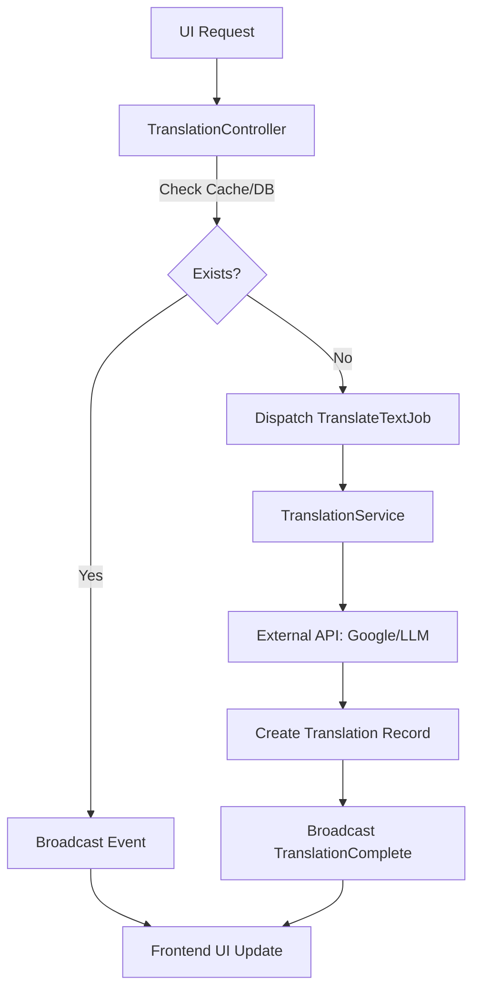

## Crafting a Scalable Translation Engine

In modern global applications, providing content in multiple languages is no longer a luxury—it's a core requirement. However, translating complex datasets like examination questions in real-time presents a unique set of challenges: high latency from external APIs, cost management, and ensuring a smooth user experience.

Today, we delve into the architecture of our distributed translation process, designed to handle these challenges through asynchronous workflows and smart orchestration.

## The Architecture at a Glance

Our system follows an event-driven pattern that separates the user-facing request from the resource-heavy translation logic.



## 1. The Entry Point: Orchestrating State

The process begins with the `TranslationController`. Instead of executing the translation immediately, it manages the state of the request. By using hashing and caching, we ensure that redundant requests for the same content-language pair are handled efficiently.

```php
public function __invoke(Request $request)
{
    $hash = hash('sha256', "$source:$target:$questionId");
    $translation = Translation::where('hash', $hash)->first();

    if ($translation) {
        // Instant feedback if already translated
        event(new TranslationComplete($translation, $userId));
        return response()->json($translation);
    }

    // Mark as pending and offload to the background
    Cache::put("translation:pending:$hash", true, now()->addMinutes(5));
    TranslateTextJob::dispatch($hash, $question, $source, $target, $userId);

    return response()->json(['status' => 'queued']);
}
```

## 2. Background Processing: The Distributed Worker

The `TranslateTextJob` acts as the bridge between the request and the service layer. Running in the background, it ensures the main application remains responsive while waiting for external translation services.

```php
public function handle(): void
{
    if (Translation::where('hash', $this->hash)->exists()) {
        Cache::forget("translation:pending:$this->hash");
        return;
    }

    $translationService = new TranslationService;
    $translation = $translationService->translateQuestion($this->question, $this->target, $this->source);

    TranslationComplete::dispatch($translation, $this->userId);
    Cache::forget("translation:pending:$this->hash");
}
```

## 3. Smart Batching: Optimizing the Payload

The core logic resides in the `TranslationService`. To minimize costs and latency, we implement "Smart Batching"—collecting all translatable parts (question text, descriptions, answers) and sending them in a single payload to the translation provider.

```php
private function translateWithGoogle(Question $question, string $target, string $source): Translation
{
    $textsToTranslate = [];
    $keyMap = [];

    // Collect all parts into a flat array for batching
    $textsToTranslate[] = (string) $question->question;
    $keyMap[] = ['type' => 'question'];

    foreach ($question->answers as $answer) {
        $textsToTranslate[] = $answer->answer;
        $keyMap[] = ['type' => 'answer', 'id' => $answer->id];
    }

    // Single Batch Call
    $translatedTexts = $this->client->translate($textsToTranslate, $target, $source);

    // Reconstruct the structured data
    return $this->createTranslationModel($question, $source, $target, $translatedData);
}
```

## 4. Real-time Synchronization: Broadcasting

Once the translation is complete, the system needs to notify the user. We use Laravel's broadcasting capabilities to push the results directly to the user's browser over a private websocket channel.

```php
class TranslationComplete implements ShouldBroadcast
{
    public function broadcastOn()
    {
        return [new PrivateChannel('App.Models.User.' . $this->userId)];
    }
}
```

## Conclusion

By decoupling the translation logic from the request cycle, we achieved a system that is both resilient and highly performant. The combination of **asynchronous jobs**, **intelligent caching**, and **batch processing** allow us to provide a premium, multi-lingual experience without compromising on speed or reliability.
